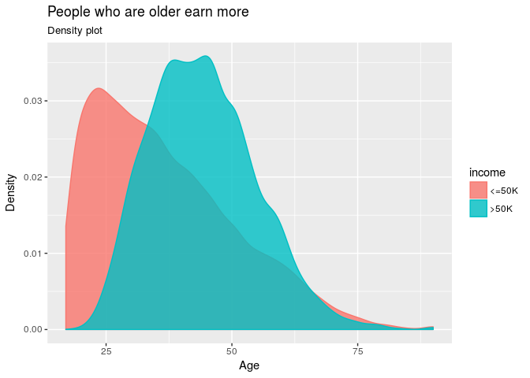
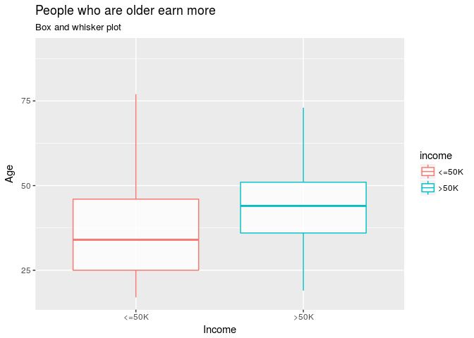

# Validating some Beliefs about Income Bias
David Pinto  
March 31, 2017  


## Introduction

In this kernel we will use `tidyverse` to validade some popular hypothesis about bias in income. Then we will fit some machine learning models to get more accurated answers.

Some analyses presented here are based on the book [Mastering Python for Data Science](https://www.amazon.com/Mastering-Python-Science-Samir-Madhavan/dp/1784390151).

So, let's get started!

## Load Required Packages

We will need the following `R` packages:


```r
library(readr)   # To import data
library(tidyr)   # To clean and format data
library(dplyr)   # To manipulate data
library(purrr)   # To do functional programming
library(ggplot2) # To visualize data
library(caret)   # To do machine learning
library(fastknn) # To fit a fast KNN model
library(ranger)  # To fit a fast Random Forest model
```

Here we will use the notation `package_name::function_name()` to make it easy to know the package that provides each function.

## Data Preprocessing

### Import Data


```r
adult <- readr::read_csv("adult.csv.zip", na = "?")
dplyr::glimpse(adult)
```

```
## Observations: 32,561
## Variables: 15
## $ age            <int> 90, 82, 66, 54, 41, 34, 38, 74, 68, 41, 45, 38,...
## $ workclass      <chr> NA, "Private", NA, "Private", "Private", "Priva...
## $ fnlwgt         <int> 77053, 132870, 186061, 140359, 264663, 216864, ...
## $ education      <chr> "HS-grad", "HS-grad", "Some-college", "7th-8th"...
## $ education.num  <int> 9, 9, 10, 4, 10, 9, 6, 16, 9, 10, 16, 15, 13, 1...
## $ marital.status <chr> "Widowed", "Widowed", "Widowed", "Divorced", "S...
## $ occupation     <chr> NA, "Exec-managerial", NA, "Machine-op-inspct",...
## $ relationship   <chr> "Not-in-family", "Not-in-family", "Unmarried", ...
## $ race           <chr> "White", "White", "Black", "White", "White", "W...
## $ sex            <chr> "Female", "Female", "Female", "Female", "Female...
## $ capital.gain   <int> 0, 0, 0, 0, 0, 0, 0, 0, 0, 0, 0, 0, 0, 0, 0, 0,...
## $ capital.loss   <int> 4356, 4356, 4356, 3900, 3900, 3770, 3770, 3683,...
## $ hours.per.week <int> 40, 18, 40, 40, 40, 45, 40, 20, 40, 60, 35, 45,...
## $ native.country <chr> "United-States", "United-States", "United-State...
## $ income         <chr> "<=50K", "<=50K", "<=50K", "<=50K", "<=50K", "<...
```

Now, let's check the class proportions:


```r
table(adult$income)
```

```
## 
## <=50K  >50K 
## 24720  7841
```

So, we have an **imbalanced classification** dataset.

### Select Variables

Here we will remove meaningless variables:


```r
dataset <- dplyr::select(adult, -fnlwgt, -capital.gain, -capital.loss)
```

### Transform Variables

Now, we will transform all `character` variables to `factor`, a more efficient format to represent categorical variables.


```r
chr.vars <- which(purrr::map_lgl(dataset, is.character))
dataset  <- dplyr::mutate_each(dataset, funs(as.factor), chr.vars)

## Compare object sizes
sprintf(
   "character size: %s; factor size: %s",
   format(object.size(adult$native.country), units = "KB"),
   format(object.size(dataset$native.country), units = "KB")
)
```

```
## [1] "character size: 256.5 Kb; factor size: 130 Kb"
```

### Deal with Missing Values

The `adult` dataset has some missing values. More specifically:


```r
# Number of instances with missing values
sum(!complete.cases(adult))
```

```
## [1] 2399
```

The simplest way to impute missing values consists in replacing them with the `mean` or `median` for numerical variables and with the `mode` for categorical ones, as follows:


```r
na.fill <- purrr::map(dataset, function(column) {
   if (is.numeric(column)) {
      return(median(column))
   } else {
      column.tbl <- table(column)
      return(names(column.tbl)[which.max(column.tbl)])
   }
})
dataset <- tidyr::replace_na(dataset, replace = na.fill)
dplyr::glimpse(dataset)
```

```
## Observations: 32,561
## Variables: 12
## $ age            <int> 90, 82, 66, 54, 41, 34, 38, 74, 68, 41, 45, 38,...
## $ workclass      <fctr> Private, Private, Private, Private, Private, P...
## $ education      <fctr> HS-grad, HS-grad, Some-college, 7th-8th, Some-...
## $ education.num  <int> 9, 9, 10, 4, 10, 9, 6, 16, 9, 10, 16, 15, 13, 1...
## $ marital.status <fctr> Widowed, Widowed, Widowed, Divorced, Separated...
## $ occupation     <fctr> Prof-specialty, Exec-managerial, Prof-specialt...
## $ relationship   <fctr> Not-in-family, Not-in-family, Unmarried, Unmar...
## $ race           <fctr> White, White, Black, White, White, White, Whit...
## $ sex            <fctr> Female, Female, Female, Female, Female, Female...
## $ hours.per.week <int> 40, 18, 40, 40, 40, 45, 40, 20, 40, 60, 35, 45,...
## $ native.country <fctr> United-States, United-States, United-States, U...
## $ income         <fctr> <=50K, <=50K, <=50K, <=50K, <=50K, <=50K, <=50...
```

Or we can just remove instances/observations with missing values:


```r
dataset <- na.omit(dataset)
```

## Exploratory Data Analysis

Let's explore the dataset and understand the patterns with the data before building any machine learning model.

### Hypothesis 1: People who are older earn more

The variable `age` is numeric, so we can check its distribution with respect to the `income` labels using a density plot:


```r
ggplot(dataset, aes(x = age, color = income, fill = income)) +
   geom_density(alpha = 0.8) +
   labs(x = "Age", y = "Density", title = "People who are older earn more",
        subtitle = "Density plot")
```



Or a boxplot:


```r
ggplot(dataset, aes(x = income, y = age, color = income)) +
   geom_boxplot(alpha = 0.8, outlier.shape = NA) +
   labs(x = "Income", y = "Age", title = "People who are older earn more",
        subtitle = "Box and whisker plot")
```



New let's estimate the central tendency for the `age` in both groups:


```r
dataset %>% 
   dplyr::group_by(income) %>% 
   dplyr::summarise(age = median(age))
```

```
## # A tibble: 2 × 2
##   income   age
##   <fctr> <dbl>
## 1  <=50K    34
## 2   >50K    44
```

So, people who earn above 50K tend to be aged around 44, while people who earn below 50K tend to be aged around 34.
