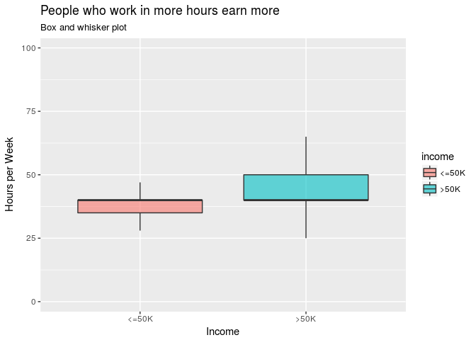

Validating some Beliefs about Income Bias
================
David Pinto
March 31, 2017

Introduction
------------

In this kernel we will use `tidyverse` to validate some popular hypothesis about bias in income. Then we will fit some machine learning models to get more accurate answers.

Some analyses presented here were took from the book [Mastering Python for Data Science](https://www.amazon.com/Mastering-Python-Science-Samir-Madhavan/dp/1784390151).

So, let's get started!

Load Required Packages
----------------------

We will need the following `R` packages:

``` r
library(readr)    # To import data
library(magrittr) # To use the pipe %>% operator
library(tidyr)    # To clean and format data
library(dplyr)    # To manipulate data
library(purrr)    # To do functional programming
library(ggplot2)  # To visualize data
library(caret)    # To do machine learning
library(fastknn)  # To fit a fast KNN model
library(ranger)   # To fit a fast Random Forest model
```

Here we will use the notation `package_name::function_name()` to make it easy to know the package that provides each function.

Data Preprocessing
------------------

### Import Data

``` r
adult <- readr::read_csv("adult.csv.zip", na = "?")
dplyr::glimpse(adult)
```

    ## Observations: 32,561
    ## Variables: 15
    ## $ age            <int> 90, 82, 66, 54, 41, 34, 38, 74, 68, 41, 45, 38,...
    ## $ workclass      <chr> NA, "Private", NA, "Private", "Private", "Priva...
    ## $ fnlwgt         <int> 77053, 132870, 186061, 140359, 264663, 216864, ...
    ## $ education      <chr> "HS-grad", "HS-grad", "Some-college", "7th-8th"...
    ## $ education.num  <int> 9, 9, 10, 4, 10, 9, 6, 16, 9, 10, 16, 15, 13, 1...
    ## $ marital.status <chr> "Widowed", "Widowed", "Widowed", "Divorced", "S...
    ## $ occupation     <chr> NA, "Exec-managerial", NA, "Machine-op-inspct",...
    ## $ relationship   <chr> "Not-in-family", "Not-in-family", "Unmarried", ...
    ## $ race           <chr> "White", "White", "Black", "White", "White", "W...
    ## $ sex            <chr> "Female", "Female", "Female", "Female", "Female...
    ## $ capital.gain   <int> 0, 0, 0, 0, 0, 0, 0, 0, 0, 0, 0, 0, 0, 0, 0, 0,...
    ## $ capital.loss   <int> 4356, 4356, 4356, 3900, 3900, 3770, 3770, 3683,...
    ## $ hours.per.week <int> 40, 18, 40, 40, 40, 45, 40, 20, 40, 60, 35, 45,...
    ## $ native.country <chr> "United-States", "United-States", "United-State...
    ## $ income         <chr> "<=50K", "<=50K", "<=50K", "<=50K", "<=50K", "<...

Now, let's check the class proportions:

``` r
table(adult$income)
```

    ## 
    ## <=50K  >50K 
    ## 24720  7841

So, we have an **imbalanced classification** dataset.

### Select Variables

Let's remove meaningless variables:

``` r
dataset <- dplyr::select(adult, -fnlwgt, -education.num,
                         -capital.gain, -capital.loss)
```

### Transform Variables

Now, we will transform all `character` columns to `factor`, a more efficient format to represent categorical variables.

``` r
chr.vars <- which(purrr::map_lgl(dataset, is.character))
dataset  <- dplyr::mutate_each(dataset, funs(as.factor), chr.vars)

## Compare object sizes
sprintf(
   "character size: %s; factor size: %s",
   format(object.size(adult$native.country), units = "KB"),
   format(object.size(dataset$native.country), units = "KB")
)
```

    ## [1] "character size: 256.5 Kb; factor size: 130 Kb"

### Deal with Missing Values

The `adult` dataset has some missing values. More specifically:

``` r
# Number of instances with missing values
sum(!complete.cases(adult))
```

    ## [1] 2399

The simplest way to impute missing values consists in replacing them with the `mean` or `median` for numerical variables and with the `mode` for categorical ones, as follows:

``` r
na.fill <- purrr::map(dataset, function(column) {
   if (is.numeric(column)) {
      return(median(column))
   } else {
      column.tbl <- table(column)
      return(names(column.tbl)[which.max(column.tbl)])
   }
})
dataset <- tidyr::replace_na(dataset, replace = na.fill)
dplyr::glimpse(dataset)
```

    ## Observations: 32,561
    ## Variables: 11
    ## $ age            <int> 90, 82, 66, 54, 41, 34, 38, 74, 68, 41, 45, 38,...
    ## $ workclass      <fctr> Private, Private, Private, Private, Private, P...
    ## $ education      <fctr> HS-grad, HS-grad, Some-college, 7th-8th, Some-...
    ## $ marital.status <fctr> Widowed, Widowed, Widowed, Divorced, Separated...
    ## $ occupation     <fctr> Prof-specialty, Exec-managerial, Prof-specialt...
    ## $ relationship   <fctr> Not-in-family, Not-in-family, Unmarried, Unmar...
    ## $ race           <fctr> White, White, Black, White, White, White, Whit...
    ## $ sex            <fctr> Female, Female, Female, Female, Female, Female...
    ## $ hours.per.week <int> 40, 18, 40, 40, 40, 45, 40, 20, 40, 60, 35, 45,...
    ## $ native.country <fctr> United-States, United-States, United-States, U...
    ## $ income         <fctr> <=50K, <=50K, <=50K, <=50K, <=50K, <=50K, <=50...

Or we can just remove instances/observations with missing values:

``` r
dataset <- na.omit(dataset)
```

Exploratory Data Analysis
-------------------------

Let's explore the dataset and understand the patterns with the data before building any machine learning model.

### Hypothesis 1: People who are older earn more

The variable `age` is numeric, so we can check its distribution with respect to the `income` labels using a density plot:

``` r
ggplot(dataset, aes(x = age, color = income, fill = income)) +
   geom_density(alpha = 0.8) +
   labs(x = "Age", y = "Density", title = "People who are older earn more",
        subtitle = "Density plot")
```


Or a boxplot:

``` r
ggplot(dataset, aes(x = income, y = age, fill = income)) +
   geom_boxplot(alpha = 0.6, outlier.shape = NA) +
   labs(x = "Income", y = "Age", title = "People who are older earn more",
        subtitle = "Box and whisker plot")
```


Now let's estimate the central tendency for the `age` in both groups:

``` r
dataset %>% 
   dplyr::group_by(income) %>% 
   dplyr::summarise(age = median(age))
```

    ## # A tibble: 2 × 2
    ##   income   age
    ##   <fctr> <dbl>
    ## 1  <=50K    34
    ## 2   >50K    44

So, people who earn above 50K tend to be aged around 44, while people who earn below 50K tend to be aged around 34.

### Hypothesis 2: Income bias based on working class

We can use a stacked bar chart to visualize the income class proportions for each working class, as follows:

``` r
ggplot(dataset, aes(x = workclass, fill = income, color = income)) +
   geom_bar(alpha = 0.8, position = "fill") +
   coord_flip() +
   labs(x = "Working Class", y = "Proportion", title = "Income bias based on working class",
        subtitle = "Stacked bar plot")
```


Now, to be more precise, let's calculate the class proportions:

``` r
prop.table(table(dataset$workclass, dataset$income), 1) * 100
```

    ##                   
    ##                        <=50K      >50K
    ##   Federal-gov       61.35417  38.64583
    ##   Local-gov         70.52078  29.47922
    ##   Never-worked     100.00000   0.00000
    ##   Private           78.99071  21.00929
    ##   Self-emp-inc      44.26523  55.73477
    ##   Self-emp-not-inc  71.50728  28.49272
    ##   State-gov         72.80431  27.19569
    ##   Without-pay      100.00000   0.00000

We see that people who are self-employed and have a company are more likely to earn above 50K.

### Hypothesis 3: People with more education earn more

Education is an important field. It should be related to the level of earning power of an individual:

``` r
ggplot(dataset, aes(x = education, fill = income, color = income)) +
   geom_bar(alpha = 0.8, position = "fill") +
   coord_flip() +
   labs(x = "Education Level", y = "Proportion", title = "People with more education earn more",
        subtitle = "Stacked bar plot")
```


``` r
prop.table(table(dataset$education, dataset$income), 1) * 100
```

    ##               
    ##                     <=50K       >50K
    ##   10th          93.354770   6.645230
    ##   11th          94.893617   5.106383
    ##   12th          92.378753   7.621247
    ##   1st-4th       96.428571   3.571429
    ##   5th-6th       95.195195   4.804805
    ##   7th-8th       93.808050   6.191950
    ##   9th           94.747082   5.252918
    ##   Assoc-acdm    75.164011  24.835989
    ##   Assoc-voc     73.878437  26.121563
    ##   Bachelors     58.524743  41.475257
    ##   Doctorate     25.907990  74.092010
    ##   HS-grad       84.049138  15.950862
    ##   Masters       44.341265  55.658735
    ##   Preschool    100.000000   0.000000
    ##   Prof-school   26.562500  73.437500
    ##   Some-college  80.976546  19.023454

We can see a strong income bias: `Doctorate` &gt; `Masters` &gt; `Bacharelors`. So, the more the person is educated, the greater the probability to earn above 50K.

### Hypothesis 4: Married people tend to earn more

Let's do the same thing considering now the marital status:

``` r
ggplot(dataset, aes(x = marital.status, fill = income, color = income)) +
   geom_bar(alpha = 0.8, position = "fill") +
   coord_flip() +
   labs(x = "Marital Status", y = "Proportion", title = "Married people tend to earn more",
        subtitle = "Stacked bar plot")
```


``` r
prop.table(table(dataset$marital.status, dataset$income), 1) * 100
```

    ##                        
    ##                             <=50K      >50K
    ##   Divorced              89.579113 10.420887
    ##   Married-AF-spouse     56.521739 43.478261
    ##   Married-civ-spouse    55.315171 44.684829
    ##   Married-spouse-absent 91.866029  8.133971
    ##   Never-married         95.403913  4.596087
    ##   Separated             93.560976  6.439024
    ##   Widowed               91.440081  8.559919

Wee can see that people who are married earn better as compared to people who are single.

### Hypothesis 5: There is a bias in income based on race

Let's see how earning power is based on the race of the person:

``` r
ggplot(dataset, aes(x = race, fill = income, color = income)) +
   geom_bar(alpha = 0.8, position = "fill") +
   coord_flip() +
   labs(x = "Race", y = "Proportion", title = "There is a bias in income based on race",
        subtitle = "Stacked bar plot")
```


``` r
prop.table(table(dataset$race, dataset$income), 1) * 100
```

    ##                     
    ##                          <=50K      >50K
    ##   Amer-Indian-Eskimo 88.424437 11.575563
    ##   Asian-Pac-Islander 73.435996 26.564004
    ##   Black              87.612036 12.387964
    ##   Other              90.774908  9.225092
    ##   White              74.414006 25.585994

Asian Pacific people and Whites have the highest earning power.

### Hypothesis 6: There is a bias in the income based on occupation

Let's see how earning power is based on the occupation of the person:

``` r
ggplot(dataset, aes(x = occupation, fill = income, color = income)) +
   geom_bar(alpha = 0.8, position = "fill") +
   coord_flip() +
   labs(x = "Occupation", y = "Proportion", title = "There is a bias in the income based on occupation",
        subtitle = "Stacked bar plot")
```


``` r
prop.table(table(dataset$occupation, dataset$income), 1) * 100
```

    ##                    
    ##                          <=50K       >50K
    ##   Adm-clerical      86.5517241 13.4482759
    ##   Armed-Forces      88.8888889 11.1111111
    ##   Craft-repair      77.3359356 22.6640644
    ##   Exec-managerial   51.5986227 48.4013773
    ##   Farming-fishing   88.4305835 11.5694165
    ##   Handlers-cleaners 93.7226277  6.2773723
    ##   Machine-op-inspct 87.5124875 12.4875125
    ##   Other-service     95.8421851  4.1578149
    ##   Priv-house-serv   99.3288591  0.6711409
    ##   Prof-specialty    65.7362527 34.2637473
    ##   Protective-serv   67.4884438 32.5115562
    ##   Sales             73.0684932 26.9315068
    ##   Tech-support      69.5043103 30.4956897
    ##   Transport-moving  79.9624296 20.0375704

We can see that people who are in specialized or managerial positions earn more.

### Hypothesis 7: Men earn more

Let's see how earning power is based on gender

``` r
ggplot(dataset, aes(x = sex, fill = income, color = income)) +
   geom_bar(alpha = 0.8, width = 0.5, position = "fill") +
   coord_flip() +
   labs(x = "Gender", y = "Proportion", title = "Men earn more",
        subtitle = "Stacked bar plot")
```


``` r
prop.table(table(dataset$occupation, dataset$income), 1) * 100
```

    ##                    
    ##                          <=50K       >50K
    ##   Adm-clerical      86.5517241 13.4482759
    ##   Armed-Forces      88.8888889 11.1111111
    ##   Craft-repair      77.3359356 22.6640644
    ##   Exec-managerial   51.5986227 48.4013773
    ##   Farming-fishing   88.4305835 11.5694165
    ##   Handlers-cleaners 93.7226277  6.2773723
    ##   Machine-op-inspct 87.5124875 12.4875125
    ##   Other-service     95.8421851  4.1578149
    ##   Priv-house-serv   99.3288591  0.6711409
    ##   Prof-specialty    65.7362527 34.2637473
    ##   Protective-serv   67.4884438 32.5115562
    ##   Sales             73.0684932 26.9315068
    ##   Tech-support      69.5043103 30.4956897
    ##   Transport-moving  79.9624296 20.0375704

That's true! It seems that males have a higher earning power as compared to females.

### Hypothesis 8: People who work in more hours earn more

Let's see how earning power is related to people working hours per week:

``` r
ggplot(dataset, aes(x = income, y = hours.per.week, fill = income)) +
   geom_boxplot(alpha = 0.6, outlier.shape = NA) +
   labs(x = "Income", y = "Hours per Week", title = "People who work in more hours earn more",
        subtitle = "Box and whisker plot")
```



``` r
dataset %>% 
   dplyr::group_by(income) %>% 
   dplyr::summarise(hours = mean(hours.per.week))
```

    ## # A tibble: 2 × 2
    ##   income    hours
    ##   <fctr>    <dbl>
    ## 1  <=50K 38.84021
    ## 2   >50K 45.47303

We can see that people who earn above 50K work more than 40 hours in average.

### Hypothesis 9: There is a bias in income based on the country of origin

Finally, let's see how earning power is related to a person's country of origin:

``` r
ggplot(dataset, aes(x = native.country, fill = income, color = income)) +
   geom_bar(alpha = 0.8, width = 0.8, position = "fill") +
   coord_flip() +
   labs(x = "Native Country", y = "Proportion", title = "There is a bias in income based on the country of origin",
        subtitle = "Stacked bar plot")
```


``` r
prop.table(table(dataset$native.country, dataset$income), 1) * 100
```

    ##                             
    ##                                   <=50K       >50K
    ##   Cambodia                    63.157895  36.842105
    ##   Canada                      67.768595  32.231405
    ##   China                       73.333333  26.666667
    ##   Columbia                    96.610169   3.389831
    ##   Cuba                        73.684211  26.315789
    ##   Dominican-Republic          97.142857   2.857143
    ##   Ecuador                     85.714286  14.285714
    ##   El-Salvador                 91.509434   8.490566
    ##   England                     66.666667  33.333333
    ##   France                      58.620690  41.379310
    ##   Germany                     67.883212  32.116788
    ##   Greece                      72.413793  27.586207
    ##   Guatemala                   95.312500   4.687500
    ##   Haiti                       90.909091   9.090909
    ##   Holand-Netherlands         100.000000   0.000000
    ##   Honduras                    92.307692   7.692308
    ##   Hong                        70.000000  30.000000
    ##   Hungary                     76.923077  23.076923
    ##   India                       60.000000  40.000000
    ##   Iran                        58.139535  41.860465
    ##   Ireland                     79.166667  20.833333
    ##   Italy                       65.753425  34.246575
    ##   Jamaica                     87.654321  12.345679
    ##   Japan                       61.290323  38.709677
    ##   Laos                        88.888889  11.111111
    ##   Mexico                      94.867807   5.132193
    ##   Nicaragua                   94.117647   5.882353
    ##   Outlying-US(Guam-USVI-etc) 100.000000   0.000000
    ##   Peru                        93.548387   6.451613
    ##   Philippines                 69.191919  30.808081
    ##   Poland                      80.000000  20.000000
    ##   Portugal                    89.189189  10.810811
    ##   Puerto-Rico                 89.473684  10.526316
    ##   Scotland                    75.000000  25.000000
    ##   South                       80.000000  20.000000
    ##   Taiwan                      60.784314  39.215686
    ##   Thailand                    83.333333  16.666667
    ##   Trinadad&Tobago             89.473684  10.526316
    ##   United-States               75.407522  24.592478
    ##   Vietnam                     92.537313   7.462687
    ##   Yugoslavia                  62.500000  37.500000

We can see that Taiwanese, French, Iranians, and Indians are the most well-earning people among different countries.

Classification using Machine Learning Models
--------------------------------------------

How can we combine all these variables to predict the income level of an unseen person?

The answer is: Machine Learning!

### Decision Tree

-   Decision trees can deal with categorical variables directly.

-   They don't require data scaling.

``` r
# Split data: 70% for training
set.seed(1024)
tr.idx <- caret::createDataPartition(dataset$income, p = 0.7, list = FALSE)

# Fit a decision tree
tree.model <- caret::train(form = income ~ ., data = dataset[tr.idx,], 
                           method = "rpart")

# Predict test set
tree.pred <- predict(tree.model, newdata = dataset[-tr.idx,])

# Performance
classAccuracy <- function(y, yhat) {
   sum(yhat == y) / length(y)
}
classAccuracy(dataset$income[-tr.idx], tree.pred)
```

    ## [1] 0.8106061

### K Nearest Neighbor (KNN)

-   Non-linear learner.

-   Simple to understand and implement.

``` r
# Encode categorical features
x <- model.matrix(income ~ . -1, data = dataset)
y <- dataset$income
dim(x)
```

    ## [1] 32561    94

``` r
# Fit KNN using the 'dist' method
knn.model <- fastknn(x[tr.idx,], y[tr.idx], x[-tr.idx,], k = 25)
classAccuracy(dataset$income[-tr.idx], knn.model$class)
```

    ## [1] 0.8010852

``` r
# Fit KNN using the 'vote' method
knn.model <- fastknn(x[tr.idx,], y[tr.idx], x[-tr.idx,], k = 25, 
                     method = "vote")
classAccuracy(dataset$income[-tr.idx], knn.model$class)
```

    ## [1] 0.8040541

``` r
# Fit KNN using the 'dist' method with normalization
knn.model <- fastknn(x[tr.idx,], y[tr.idx], x[-tr.idx,], k = 25, 
                     method = "vote", normalize = "robust")
classAccuracy(dataset$income[-tr.idx], knn.model$class)
```

    ## [1] 0.8219697

``` r
# Find the best k
set.seed(2048)
cv.out <- fastknnCV(x[tr.idx,], y[tr.idx], k = seq(from = 10, to = 30, by = 5), 
                    method = "vote", normalize = "robust", 
                    folds = 10, nthread = 8)
cv.out$cv_table
```

|  fold\_1|  fold\_2|  fold\_3|  fold\_4|  fold\_5|  fold\_6|  fold\_7|  fold\_8|  fold\_9|  fold\_10|   mean|    k|
|--------:|--------:|--------:|--------:|--------:|--------:|--------:|--------:|--------:|---------:|------:|----:|
|    0.174|    0.168|    0.183|    0.172|    0.170|    0.167|    0.178|    0.174|    0.165|     0.166|  0.171|   10|
|    0.180|    0.172|    0.188|    0.168|    0.162|    0.164|    0.176|    0.170|    0.163|     0.166|  0.171|   15|
|    0.179|    0.166|    0.179|    0.164|    0.165|    0.162|    0.166|    0.171|    0.160|     0.169|  0.168|   20|
|    0.175|    0.172|    0.182|    0.163|    0.171|    0.165|    0.168|    0.172|    0.162|     0.165|  0.169|   25|
|    0.173|    0.172|    0.183|    0.164|    0.168|    0.166|    0.169|    0.173|    0.159|     0.165|  0.169|   30|

### Random Forest

-   Combine simple models (decision trees) to build a more complex one.

-   The base models can be trained in parallel.

-   Allow ranking the variables.

``` r
# Fit Random Forest
rf.model <- ranger::ranger(income ~ ., dataset[tr.idx,], num.trees = 500, 
                           mtry = 2, importance = "impurity", num.threads = 8)

# Predict test set
rf.pred <- predict(rf.model, dataset[-tr.idx,])

# Performance
classAccuracy(dataset$income[-tr.idx], rf.pred$predictions)
```

    ## [1] 0.8360975

Computing variable importance:

``` r
# Variable importance
var.imp <- ranger::importance(rf.model)
var.imp <- dplyr::data_frame(variable = names(var.imp), importance = var.imp) %>% 
   dplyr::arrange(desc(importance))
var.imp
```

| variable       |  importance|
|:---------------|-----------:|
| relationship   |     876.919|
| age            |     805.544|
| marital.status |     626.251|
| education      |     610.490|
| hours.per.week |     544.320|
| occupation     |     443.333|
| workclass      |     208.261|
| sex            |     141.644|
| native.country |     103.167|
| race           |      85.120|
